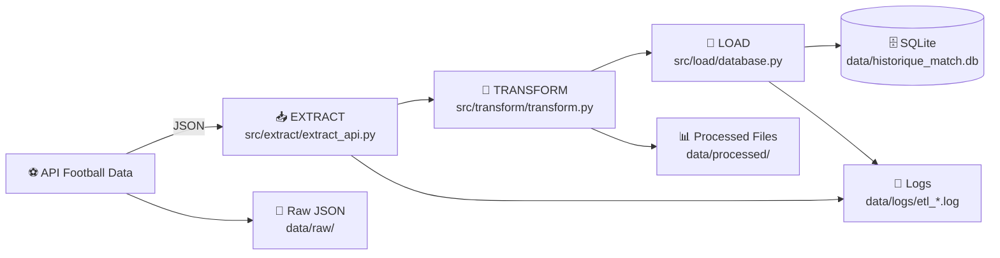
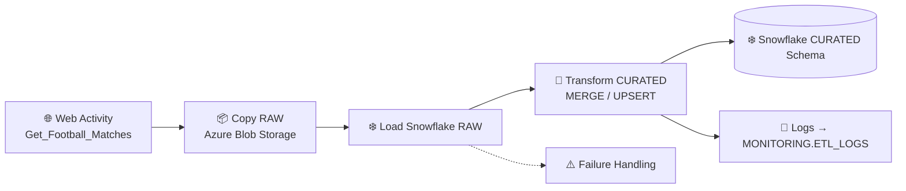
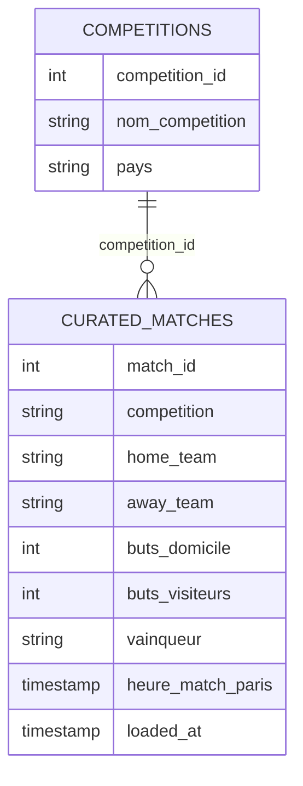

# ⚽ FootballAnalytics_Python

> 🚀 **Projet Data Engineering complet** : pipeline **ETL en Python** pour extraire, transformer et charger les données de matchs de football depuis l’API _Football-Data.org_ dans **SQLite**, puis migration vers le **Cloud (ADF + Snowflake)** et visualisation via **Streamlit**.

---

## 🏷️ Badges techniques

---

## 🧠 Objectif

Automatiser le suivi et la transformation des données de matchs :

1. **Extraction** depuis l’API `football-data.org`  
2. **Transformation** des données brutes en DataFrames propres  
3. **Chargement** dans une base **SQLite**  
4. **Journalisation complète** via `logger_config.py`  
5. **Migration Cloud** → *Azure Data Factory + Snowflake*  
6. **Visualisation temps réel** → *Streamlit*  

Ce pipeline constitue la **brique Python locale** du projet complet *Football Analytics Data Platform*.

---

## 🧩 Stack technique

| Outil / Lib | Usage principal |
|--------------|----------------|
| 🐍 **Python** | Développement du pipeline ETL |
| 🌐 **Requests** | Appels API REST |
| 🧮 **Pandas** | Transformation |
| 🗄️ **SQLite3** | Base locale |
| 🧾 **Logging / dotenv** | Logs & secrets |
| ☁️ **Azure Data Factory** | Orchestration Cloud |
| ❄️ **Snowflake** | Data Warehouse |
| 📊 **Streamlit** | Dashboard |

---

## 🗂️ Structure du projet

---

# 🧠 Architecture du pipeline Python

# 🧠 Architecture du pipeline ADF

##  🗄️ Structure des tables SnowflakeADF
### 🧊 RAW.MATCHES (semi-structuré)
| Colonne | Type | Description |
|--------|------|-------------|
| payload_raw | VARIANT | JSON complet du match |
| load_time | TIMESTAMP | Timestamp du chargement |
| source_file | STRING | Nom du fichier JSON ingéré |

---

### 📘 CURATED.MATCHES (nettoyée & enrichie)
| Colonne | Type | Description |
|--------|------|-------------|
| match_id | INTEGER | Identifiant unique du match |
| competition | STRING | Nom de la compétition |
| home_team | STRING | Équipe domicile |
| away_team | STRING | Équipe extérieure |
| buts_domicile | INTEGER | Nombre de buts domicile |
| buts_visiteurs | INTEGER | Nombre de buts extérieur |
| vainqueur | STRING | "Home" / "Away" / "Draw" |
| heure_match_paris | TIMESTAMP | Date/heure convertie en UTC+1/UTC+2 |
| loaded_at | TIMESTAMP | Timestamp ingestion pipeline |

## 🧱 Modèle de données Snowflake (CURATED)

---

# 🖥️ 4. Fonctionnalités de l'application Streamlit

## 🖥️ Fonctionnalités Streamlit

### 🎛️ Filtres interactifs
- Filtre par **compétition**

### 📊 Visualisations
- Histogramme des buts par compétition
- Évolution des scores dans le temps
- Tableau dynamique des matchs

### 🔁 Fonctionnalités avancées
- Auto-refresh grâce à `streamlit-autorefresh`
- Connexion Snowflake → Streamlit pour données live
- Mise en forme thématique “Football Analytics”

### ☁️ Architecture d’accès
Snowflake → Python Connector → Streamlit Cloud / Local

